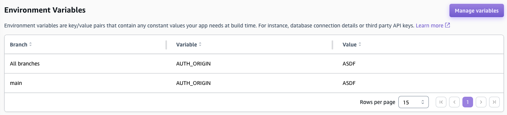

My app: https://ap-southeast-2.console.aws.amazon.com/amplify/apps/d1krv9yvfuee28

Public URL: https://main.d1krv9yvfuee28.amplifyapp.com/api/hello

Note that `AUTH_ORIGIN` is `undefined`.

I am using the `aws-amplify` preset: https://github.com/lmiller1990/nuxt3-amplify/blob/8cb4dec0cce5bd665f32a3446de15dcbaeee9277/nuxt.config.ts#L4

Works as expected on Lambda, this seems to be an issue with Amplify not adding environment variables when the server starts.

Env variables:



Why is `AUTH_ORIGIN` not there? I also tried adding it to `amplify.yml` as part of the build process, although this makes no sense - it is a runtime environment variable, so it needs to be there when the server is started. I cannot see any information around what amplify does when it starts the backend.

Locally, build it:

```
npm run build
```

Then run it:

```
AUTH_ORIGIN=ASDF node .amplify-hosting/compute/default/server.js
```

```
curl localhost:3000/api/hello
{"status":"OK. The value for process.env.AUTH_ORIGIN is: ASDF"}
```